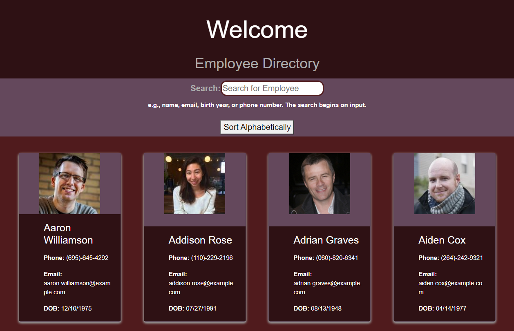
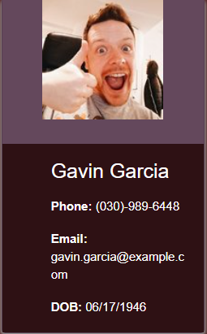

# Employee Directory

### Link to deployed site: 
https://vigilant-kirch-81084e.netlify.app/

### Link to repo:
https://github.com/myrlaf25/an-employee-directory

## Table of Contents

-[Description](#description)
-[Installation](#installation)
-[Usage](#usage)
-[Credits](#credits)
-[Tests](#tests)

# Description
Thsi application is an Employee Directory created with React.js. The application is broken into components that respond to the user events.

</img>

# User Story
* As a user, I want to be able to view my entore employee directory at once so that I have quick access to their information. 

</img>

# Business Context
An employer or even another employee would benefit from  beign able to view non-sensitive infromation about other employees. 

## Installation
The user may create their repo and then download the npx create-react-app on the terminal in the correct directory. This will create a basic react app that the user may develop into an employee directory or any other app.

# Usage
The application is pulling information from the Random User API https://randomuser.me/ . The user is able to sort the employee infromation by name. The user is also able to filter the employee by any other property. 

## Credits
The application was developed from the basic React app that is provided. I also received assitance from the tutor and Bootcamp staff. 

## Tests
The user is able to test the applciation by having the localhost running. The localhost may run in development mode by "npm start" in the terminal. React provides development tools that may be used while working on the development of the app. The terminal also lets the user know if there is something that has not been defined or if it does not understand the code.

-[GitHub] {https://github.com/myrlaf25}

##Questions
To contact me directly, please email me at: myrlaf25@gmail.com.